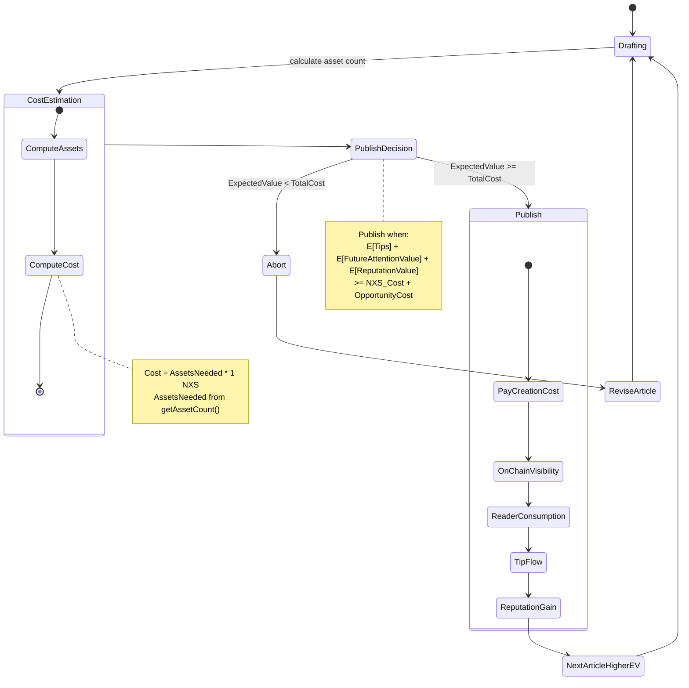
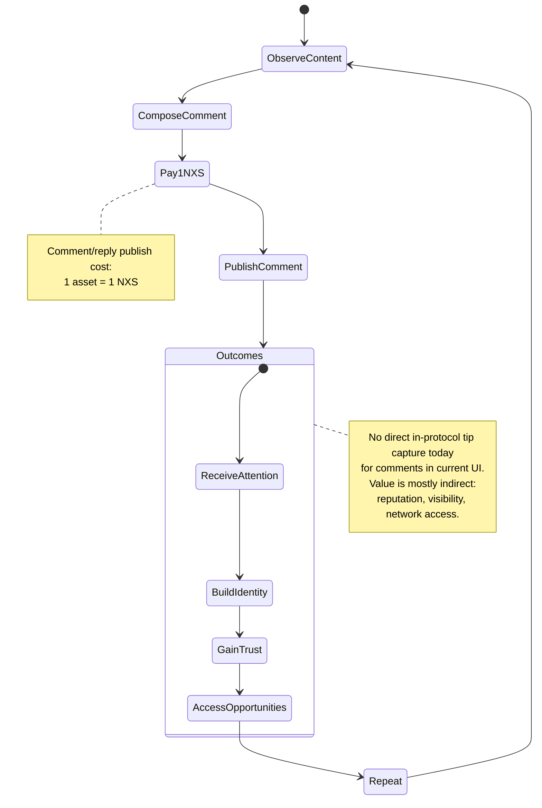
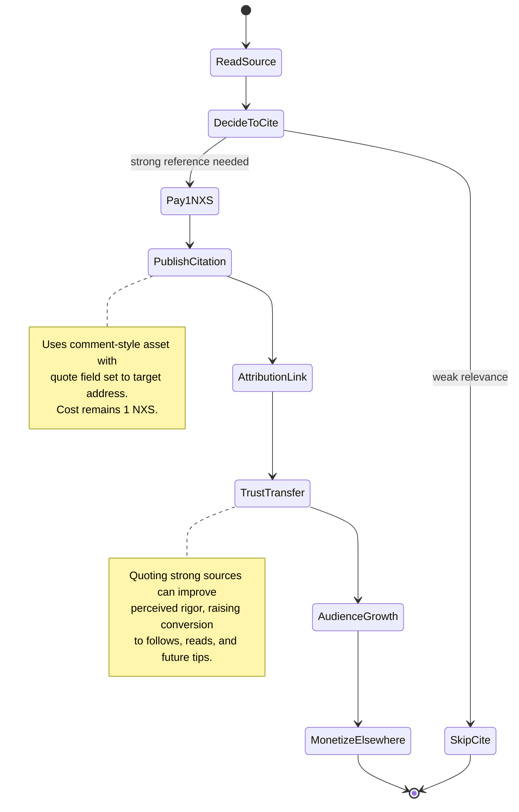
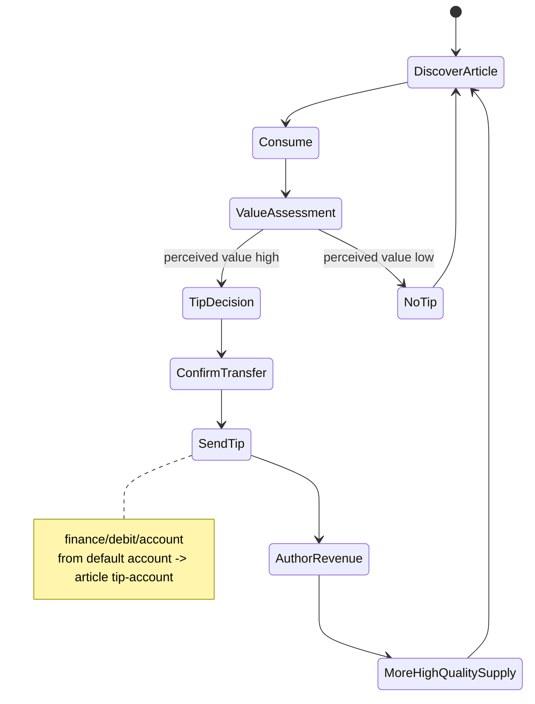
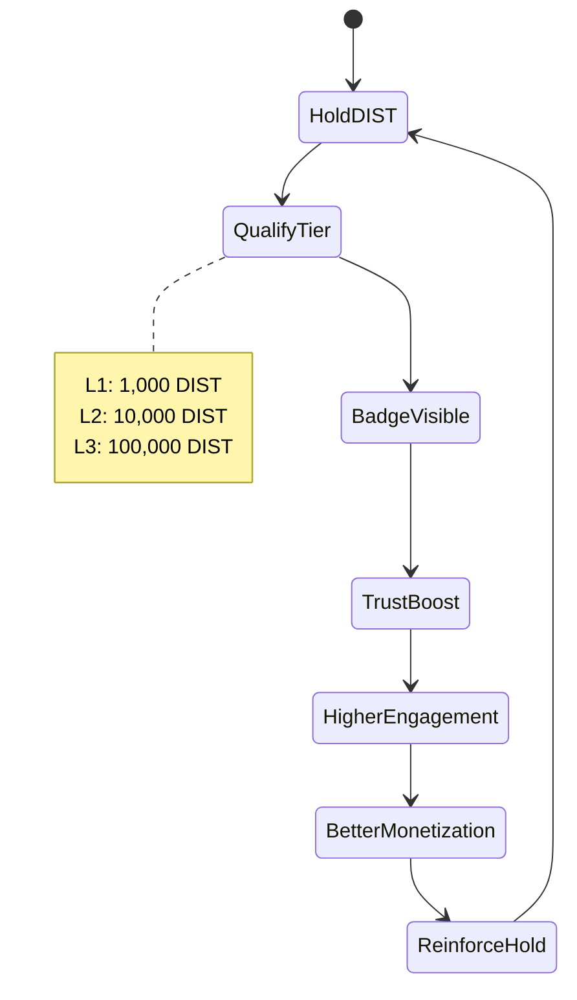
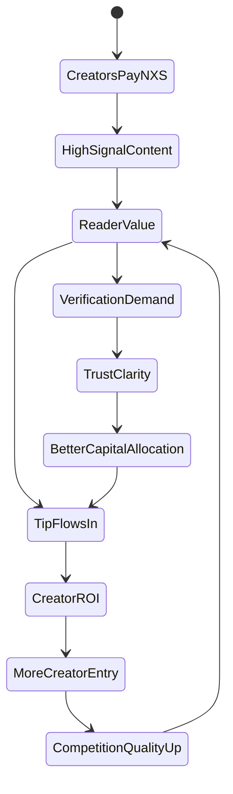

# Distordia Social - Economic Incentive State Machines

This document models the **economic incentives** of the main actors in Distordia Social, based on current implementation behavior in:
- `src/App/ComposePost.js`
- `src/actions/createAsset.js`
- `src/utils/articleUtils.js`
- `src/App/news.js`
- `src/App/profile.js`

## Grounded Economic Assumptions (Current System)

1. **Publishing cost is paid in NXS**
   - Comment / short post: `1 NXS` (`assets/create/asset`, one asset)
   - Article: `N assets = N NXS`, where:
     - `N = getAssetCount(textLength)`
     - Root asset + optional chunk assets (`distordia-article-chunk`)
2. **Tipping exists only for articles (today)**
   - Article has optional `tip-account`
   - Readers can send NXS tips through `finance/debit/account`
3. **Comments/replies/quotes are permanent on-chain records**
   - Stored as JSON assets with `reply-to` / `quote` references
4. **Verification tiers (L1/L2/L3) are social trust signals**
   - Higher perceived credibility can increase readership and tip likelihood

---

## 1) Author (Article Publisher) ROI Machine

Why pay to create an article?

**Economic proof sketch:**
- Article publishing is rational if expected direct cashflow (tips) + indirect capitalized value (future audience, reputation, collaboration, deal flow) exceeds multi-asset creation cost.
- Because article content can be long-form and tip-enabled, the model supports a higher potential upside than comments.

---

## 2) Comment / Reply Actor Utility Machine

Why pay to comment on an article?

**Economic proof sketch:**
- A commenter pays for **credibly costly signaling**: on-chain permanence + spend.
- If one high-quality comment increases future audience, job/deal probability, or traffic to tipped articles, expected lifetime value can exceed `1 NXS`.

---

## 3) Quote / Citation Actor Utility Machine

Why pay to quote/cite content?

**Economic proof sketch:**
- Citation converts external trust into personal credibility.
- If credibility lift raises conversion into future monetizable actions (tips on own articles, client leads, research reputation), paying `1 NXS` is rational.

---

## 4) Reader / Tipper Utility Machine

Why does capital enter the system via tips?

**Economic proof sketch:**
- Tips are direct capital inflow from consumers to producers.
- Successful tipping loops increase expected author ROI, increasing future content supply and potentially aggregate platform value.

---

## 5) Verification Holder (DIST) Signaling Machine

Why hold DIST for verification tiers?

**Economic proof sketch:**
- Verification behaves as an on-chain trust collateral signal.
- If badge visibility increases engagement/tips enough, holding DIST has productive utility beyond pure speculation.

---

## 6) Ecosystem Capital Flywheel (System-Level)

**Interpretation:**
- Creation fees impose friction that can reduce spam and increase signal density.
- Tip rails convert reader utility into creator revenue.
- Verification can reduce information asymmetry, improving how capital is allocated.

---

## Why Someone Pays (Direct Answers)

- **Create articles:** largest upside due to direct tip capture and durable on-chain reputation.
- **Comment/reply:** pays for attention acquisition and identity signaling; expected future upside can dominate small fixed cost.
- **Quote/cite:** pays for trust transfer from cited sources and better audience conversion over time.
- **Tip:** pays to fund value-producing creators, sustaining future content quality.

In short: users pay when expected long-term utility (cashflow + social capital + opportunity value) exceeds immediate NXS outlay.
