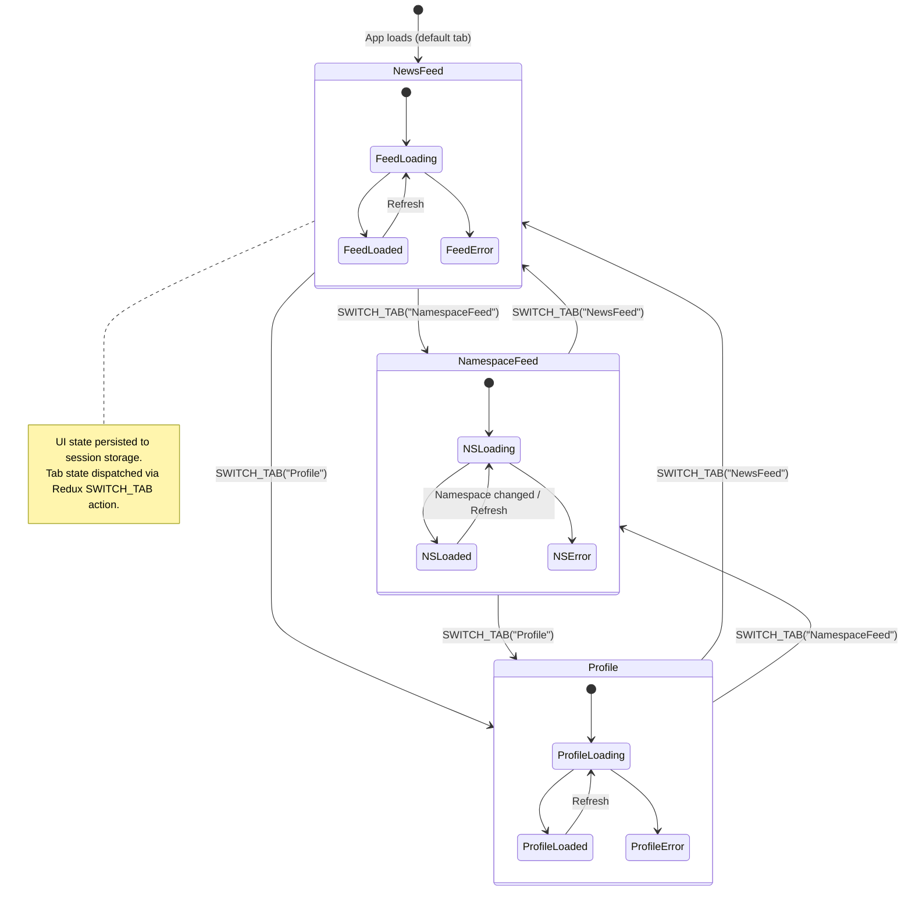
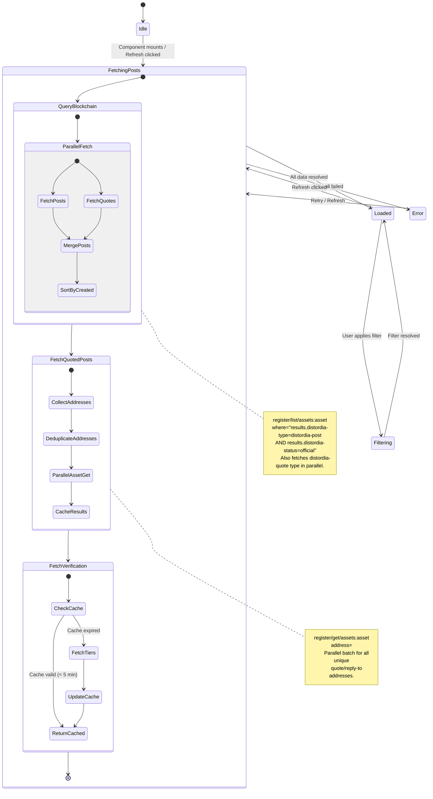
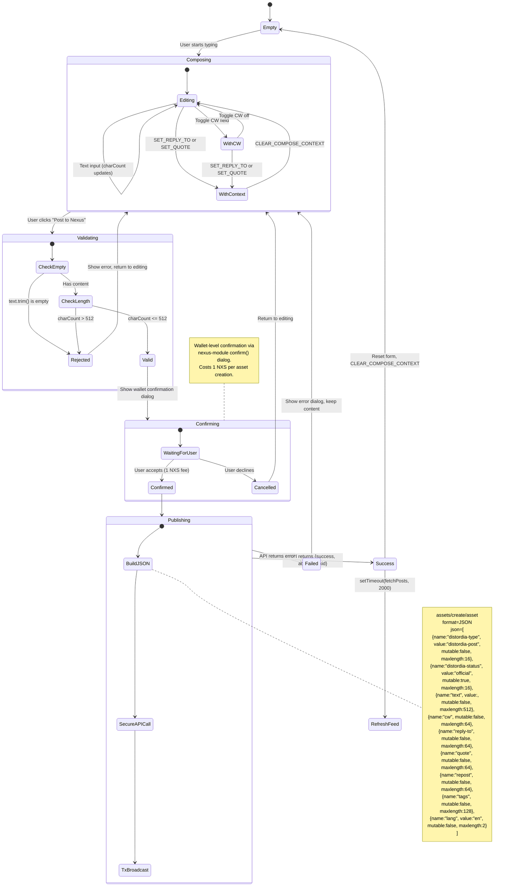
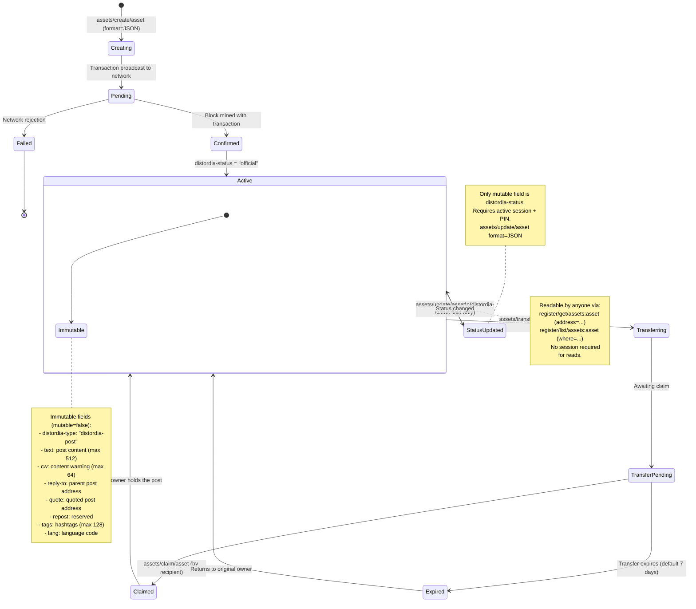
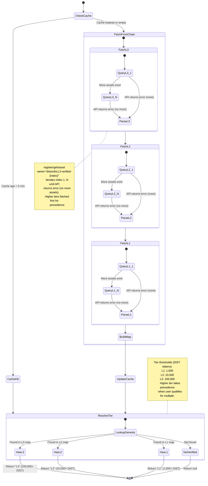
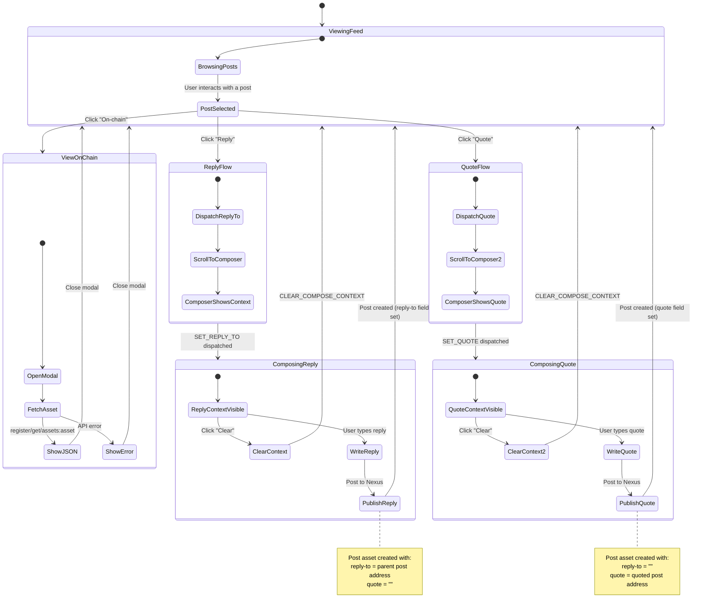
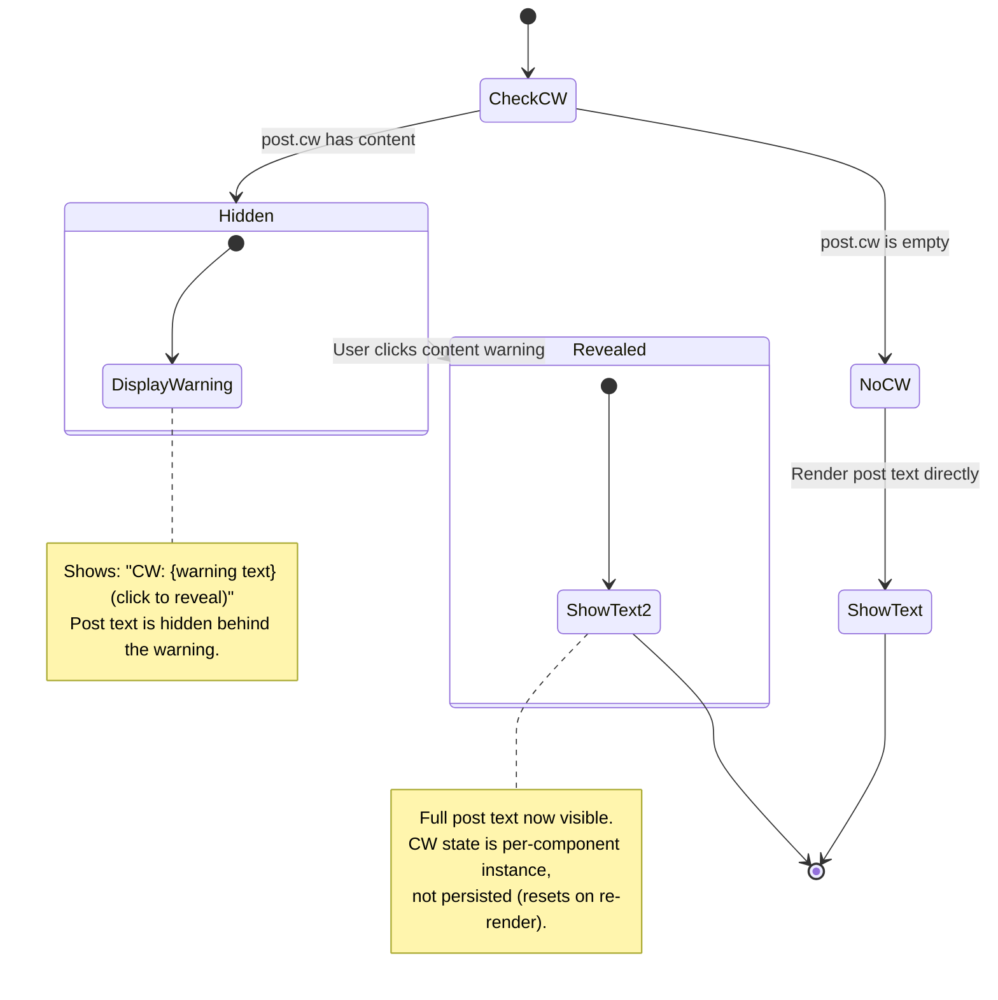
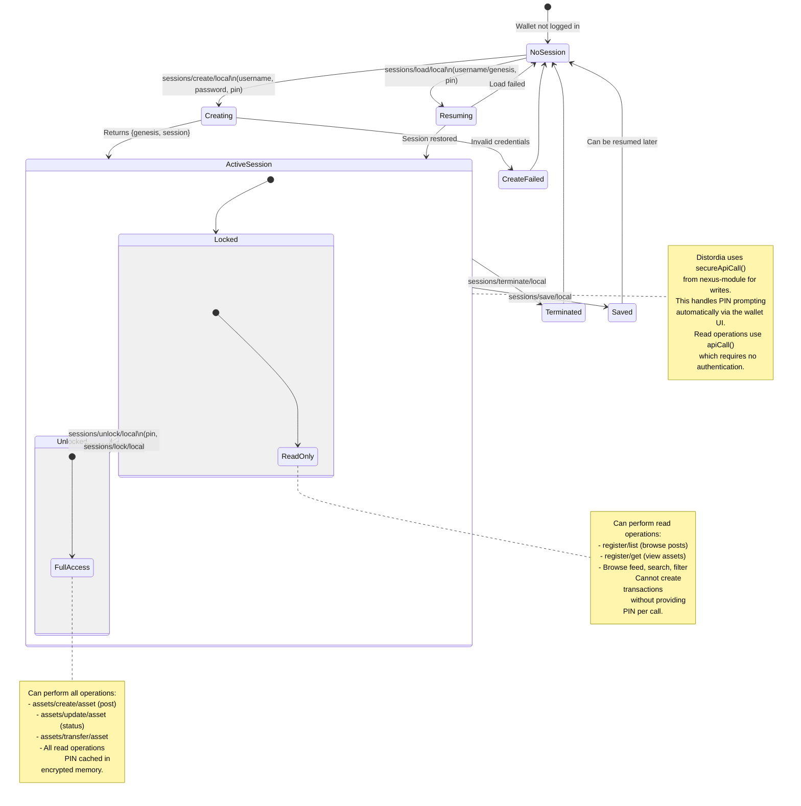
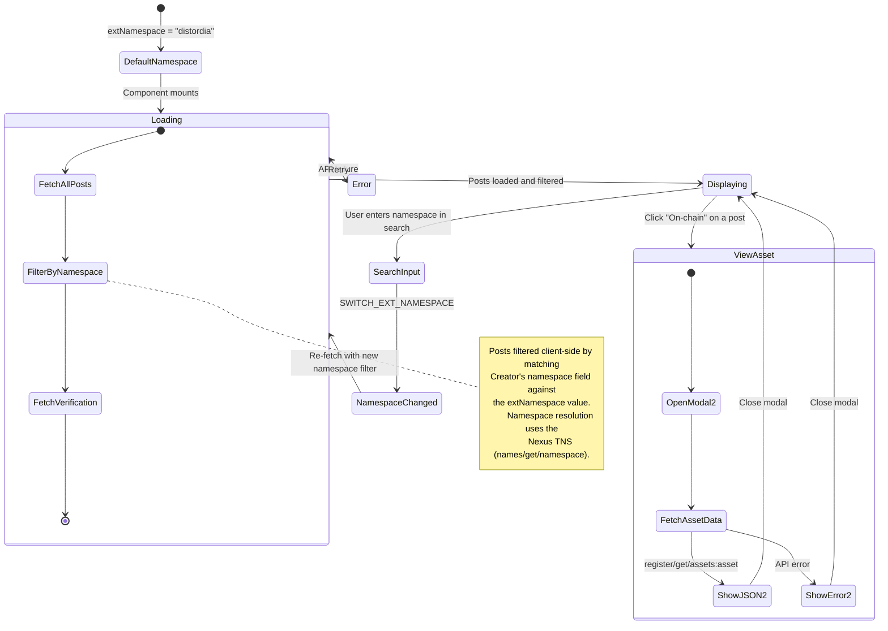

# Distordia Social - State Machine Diagrams

State machine diagrams for all core flows in the Distordia Social module, aligned with the [Nexus API](../Nexus%20API%20docs/PROTOCOL.MD) documentation.

Related economics documentation:
- [Economic Incentive State Machines](./economic-incentives-state-machines.md)
- [Economic Incentive Improvements](./economic-incentives-improvements.md)

---

## 1. Application Navigation

Top-level tab navigation across the three main views.



---

## 2. Social Feed Loading

How posts are fetched from the Nexus blockchain using the Register API. All queries are unauthenticated reads via `register/list` and `register/get`.



---

## 3. Post Composition & Publishing

The full lifecycle of composing and publishing a post as an on-chain asset via `assets/create/asset` (JSON format).



---

## 4. On-Chain Post Asset Lifecycle

How a Distordia post exists on the Nexus blockchain as a register, per the Assets API.



---

## 5. Verification Tier Resolution

How the verification badge system queries the on-chain registry and resolves tiers for users.



---

## 6. Post Interaction Flow

User interactions with existing posts: Reply, Quote, and View On-Chain.



---

## 7. Content Warning Display

The content warning reveal/hide micro-state for individual posts.



---

## 8. Redux State Management

How Redux state transitions map to user actions and API calls.

```mermaid
stateDiagram-v2
    state ReduxStore {
        state UIState {
            [*] --> DefaultUI

            state DefaultUI {
                activeTab = NewsFeed
                inputValue = ""
                replyTo = null
                quote = null
            }
        }

        state SettingsState {
            [*] --> DefaultSettings

            state DefaultSettings {
                extNamespace = "distordia"
                myNamespace = ""
            }
        }
    }

    state Actions {
        SWITCH_TAB --> UIState : Update activeTab
        UPDATE_INPUT --> UIState : Update inputValue
        SET_REPLY_TO --> UIState : Set replyTo post
        SET_QUOTE --> UIState : Set quote post
        CLEAR_COMPOSE_CONTEXT --> UIState : Reset replyTo & quote to null
        SWITCH_EXT_NAMESPACE --> SettingsState : Update extNamespace
        SWITCH_MY_NAMESPACE --> SettingsState : Update myNamespace
    }

    state Persistence {
        UIState --> SessionStorage : stateMiddleware
        SettingsState --> DiskStorage : storageMiddleware
    }

    note right of SessionStorage
        UI state persisted to session storage
        via nexus-module stateMiddleware.
        Lost when session ends.
    end note

    note right of DiskStorage
        Settings persisted to disk
        via nexus-module storageMiddleware.
        Survives app restarts.
    end note
```

---

## 9. Nexus Session & Authentication Context

How the Nexus Wallet session underpins authenticated operations. The Distordia module runs inside the wallet and relies on wallet-managed sessions.



---

## 10. Namespace Feed Flow

The namespace-specific feed that filters posts by a given Nexus namespace.



---

## 11. Profile View Flow

How the user's profile and owned posts are loaded via the Assets API.

```mermaid
stateDiagram-v2
    [*] --> LoadingProfile

    state LoadingProfile {
        [*] --> ParallelFetch2
        state ParallelFetch2 {
            [*] --> FetchMyAssets
            [*] --> FetchVerified
            FetchMyAssets --> [*]
            FetchVerified --> [*]
        }
        ParallelFetch2 --> FilterPosts
        FilterPosts --> ExtractProfileInfo
        ExtractProfileInfo --> [*]
    }

    LoadingProfile --> ProfileReady : Data loaded
    LoadingProfile --> ProfileError : API failure

    ProfileError --> LoadingProfile : Retry

    state ProfileReady {
        [*] --> DisplayProfile

        state DisplayProfile {
            [*] --> ShowProfileCard
            ShowProfileCard --> ShowMyPosts

            state ShowProfileCard {
                note right of ShowProfileCard
                    Displays:
                    - Namespace (@name or "No Namespace")
                    - Genesis ID (full hash)
                    - Post count
                    - Verification badge (if any)
                end note
            }
        }
    }

    ProfileReady --> ViewPostOnChain : Click post or "On-chain"

    state ViewPostOnChain {
        [*] --> FetchPost
        FetchPost --> DisplayJSON : register/get/assets:asset
        FetchPost --> DisplayError : API error
    }

    DisplayJSON --> ProfileReady : Close modal
    DisplayError --> ProfileReady : Close modal

    note right of FetchMyAssets
        assets/list/asset
        (authenticated, returns only
         assets owned by logged-in profile)

        Results filtered client-side for
        distordia-type = "distordia-post"
    end note

    note left of ExtractProfileInfo
        Profile info derived from first post:
        - Creator's namespace
        - owner (genesis hash)
        - Post count

        If namespace differs from stored
        myNamespace, dispatches
        SWITCH_MY_NAMESPACE.
    end note
```

---

## API Endpoint Reference

Summary of all Nexus API endpoints used by Distordia Social, mapped to the flows above.

| Flow | API Endpoint | Verb | Auth Required | Purpose |
|------|-------------|------|:---:|---------|
| Feed Loading | `register/list/assets:asset` | GET | No | Fetch all posts with `where` filter |
| Quoted Posts | `register/get/assets:asset` | GET | No | Fetch individual post by address |
| View On-Chain | `register/get/assets:asset` | GET | No | Display raw asset JSON |
| Post Creation | `assets/create/asset` | POST | Yes (PIN) | Create post as JSON-format asset |
| Status Update | `assets/update/asset` | POST | Yes (PIN) | Update mutable `distordia-status` |
| Profile Posts | `assets/list/asset` | GET | Yes (session) | List assets owned by logged-in user |
| Verification | `register/get/asset` | GET | No | Read verification registry assets |
| Session | `sessions/create/local` | POST | N/A | Create login session (wallet-managed) |
| Unlock | `sessions/unlock/local` | POST | Yes (PIN) | Unlock session for transactions |
